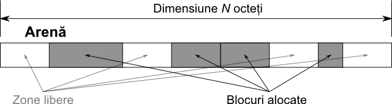

# Alocator de Memorie

## Cerința
* Programul vostru va trebui să realizeze o simulare a unui sistem de alocare de memorie.
* Programul va primi la intrare comenzi de alocare, alterare, afişare şi eliberare de memorie, şi va trebui să furnizaţi la ieşire rezultatele fiecărei comenzi.
* Nu veţi înlocui sistemul standard malloc() şi free(), ci vă veţi baza pe el, alocând la început un bloc mare de memorie, şi apoi presupunând că acela reprezintă toată “memoria” voastră, pe care trebuie s-o gestionaţi. 

## Funcţiile unui alocator de memorie
* Un alocator de memorie poate fi descris, în termenii cei mai simpli, în felul următor:
  * Primeşte un bloc mare, compact (fără “găuri”), de memorie, pe care trebuie să-l administreze. Acest bloc, în terminologia de specialitate, se numeşte arenă. De exemplu, sistemul de alocare cu malloc() are în gestiune heap-ul programului vostru, care este un segment special de memorie special rezervat pentru alocările dinamice.
  * Utilizatorii cer din acest bloc, porţiuni mai mici, de dimensiuni specificate. Alocatorul trebuie să găsească în arenă o porţiune continuă liberă (nealocată), de dimensiune mai mare sau egală cu cea cerută de utilizator, pe care apoi o marchează ca ocupată şi întoarce utilizatorului adresa de început a zonei proaspăt marcată drept alocată. Alocatorul trebuie să aibă grijă ca blocurile alocate să nu se suprapună (să fie disjuncte), pentru că altfel datele modificate într-un bloc vor altera şi datele din celălalt bloc.
  * Utilizatorii pot apoi să ceară alocatorului să elibereze o porţiune de memorie alocată în prealabil, pentru ca noul spaţiu liber să fie disponibil altor alocări.
  * La orice moment de timp, arena arată ca o succesiune de blocuri libere sau ocupate, ca în figura de mai jos.
  


* O problemă pe care o are orice alocator de memorie este cum este ţinută evidenţa blocurilor alocate, a porţiunilor libere şi a dimensiunilor acestora. Pentru această problemă există în general două soluţii:
  * Definirea unor zone de memorie separate de arenă care să conţină liste de blocuri şi descrierea acestora. Astfel, arena va conţine doar datele utilizatorilor, iar secţiunea separată va fi folosită de alocator pentru a găsi blocuri libere şi a ţine evidenţa blocurilor alocate.
  * Cealaltă soluţie, pe care voi o veţi implementa în această temă, foloseşte arena pentru a stoca informaţii despre blocurile alocate. Preţul plătit este faptul că arena nu va fi disponibilă în totalitate utilizatorilor, pentru că va conţine, pe lângă date, şi informaţiile de gestiune, însă avantajul este că nu are nevoie de memorie suplimentară şi este în general mai rapidă decât prima variantă.
  
* Există mai multe metode prin care se poate ţine evidenţa blocurilor alocate în arenă, în funcţie de performanţele dorite. Voi va trebui să implementaţi un mecanim destul de simplu, care va fi prezentat în secţiunea următoare. Deşi nu este extrem de performant, se va descurca destul de bine pe dimensiuni moderate ale arenei (de ordinul MB). 

## Structura arenei
* În continuare vom considera arena ca pe o succesiune (vector) de N octeţi (tipul de date unsigned char).
* Fiecare octet poate fi accesat prin indexul său (de la 0 la N-1).
* Vom considera că un index este un întreg cu semn pe 32 de biţi (tipul de date int pe un sistem de operare pe 32 de biţi).
* De asemenea, va fi nevoie câteodată să considerăm 4 octeţi succesivi din arenă ca reprezentând valoarea unui index.
  * În această situaţie, vom considera că acel index este reprezentat în format 'little-endian' (revedeţi exerciţiile de la laboratorul de pointeri pentru mai multe detalii), şi astfel vom putea face cast de la un pointer de tip unsigned char * la unul de tip int*, pentru a accesa valoarea indexului, stocată în arenă.
 
* Figura de mai jos ilustrează structura detaliată a arenei, în decursul execuţiei programului:


### Structura unui bloc
* Se poate observa că fiecare bloc alocat de memorie (marcat cu un chenar îngroşat) constă din două secţiuni:
  * Prima secţiune, de gestiune, este reprezentată de 12 octeţi (3 * sizeof(int)) împărţiţi în 3 întregi (a câte 4 octeţi fiecare). Cei trei întregi reprezintă următoarele:
    * Primul întreg reprezintă indexul de start al blocului următor de memorie din arenă (aflat imediat “la dreapta” blocului curent, dacă privim arena ca pe o succesiune de octeţi de la stanga la dreapta). Se consideră că un bloc începe cu secţiunea de gestiune, şi toţi indicii la blocuri vor fi trataţi ca atare. Dacă blocul este ultimul în arenă (cel mai “din dreapta”), atunci valoarea primului întreg din secţiune va fi 0.
    * Cel de-al doilea întreg din secţiune reprezintă indexul de start al blocului imediat anterior din arenă. Dacă blocul este primul în arenă, atunci valoarea acestui întreg va fi 0.
    * Cel de-al treilea întreg din secţiune reprezintă lungimea totală a blocului, adică lungimea celor două secţiuni la un loc (nu doar a datelor alocate utilizatorului).
  * A doua secţiune conţine datele efective ale utilizatorului. Secţiunea are lungimea în octeţi egală cu dimensiunea datelor cerută de utilizator la apelul funcţiei de alocare. Indicele returnat de alocator la o nouă alocare reprezintă începutul acestei secţiuni din noul bloc, şi 'nu' începutul primei secţiuni, întrucât partea de gestiune a memoriei trebuie să fie complet transparentă pentru utilizator.

### Înlănţuirea blocurilor
* După cum se poate observa din figura de mai sus, la începutul arenei sunt rezervaţi 4 octeţi care reprezintă indicele de start - indicele primului bloc (cel mai “din stânga”) din arenă. Dacă arena nu conţine nici un bloc (de exemplu, imediat după iniţializare), acest indice este 0. 
* Indicele de start marchează începutul lanţului de blocuri din arenă: din acest indice putem ajunge la începutul primului bloc, apoi folosind secţiunea de gestiune a primului bloc putem găsi începutul celui de-al doilea bloc, şi asa mai departe, până când ajungem la blocul care are indexul blocului următor 0 (este ultimul bloc din arenă). În acest mod putem traversa toate blocurile din arenă, şi de asemenea să identificăm spaţiile libere din arenă, care reprezintă spaţiile dintre două blocuri succesive. 
* Este de remarcat faptul că lanţul poate fi parcurs în ambele sensuri: dintr-un bloc putem ajunge atât la vecinul din dreapta, cât şi la cel din stânga. 
* De asemenea, atunci când este alocat un bloc nou sau este eliberat unui vechi, 'lanţul de blocuri trebuie modificat'. Astfel, la alocarea unui nou bloc de memorie, trebuie să ţineţi cont de următoarele: 
  * Spaţiul liber în care este alocat noul bloc este mărginit de cel mult două blocuri vecine. Secţiunile de gestiune ale acestor vecini trebuie modificate astfel:
    * Indexul blocului următor din structura de gestiune a blocului din stânga trebuie să indice către noul bloc. Dacă blocul din stânga nu există, atunci este modificat indicele de start.
    * Indexul blocului precedent din structura de gestiune a blocului din dreapta trebuie să indice către noul bloc. Dacă blocul din dreapta nu există, atunci nu se întâmplă nimic.
  * Secţiunea de gestiune a noului bloc va conţine indicii celor doi vecini, sau 0 în locul vecinului care lipseşte.
* La eliberarea unui bloc, trebuie modificate secţiunile de gestiune a vecinilor într-o manieră similară ca la adăugare. 

## Funcţionarea programului
* Programul vostru va trebui să implementeze o serie de operaţii de lucru cu arena, care vor fi lansate în urma comenzilor pe care le primeşte la intrare. Fiecare comandă va fi dată pe câte o linie, şi rezultatele vor trebui afişate pe loc. Secţiunea următoare prezintă sintaxa comenzilor posibile şi formatul de afişare al rezultatelor.

> [!CAUTION]
> Întrucât pentru testare comenzile vor fi furnizate prin redirectare dintr-un fişier de intrare, iar rezultatele vor fi stocate prin redirectare într-un alt fişier, programul vostru nu va trebui să afişeze nimic altceva în afara formatului specificat (de exemplu, nu trebuie să afişati mesaje de tipul “Introduceţi comanda: ”).

> [!TIP]
> Folosiţi funcţiile de manipulare a şirurilor de caractere pentru a citi şi interpreta comenzile date la intrare. Este recomandată combinaţia fgets() şi strtok() pentru o implementare elegantă. 

> [!TIP]
> Pentru o mai bună organizare a codului vostru, implementaţi execuţia fiecărei comenzi într-o funcţie separată. De asemenea, gândiţi-vă ce variabile trebuie păstrate globale, iar pe restul declaraţi-le local. 

## Formatul comenzilor
* Programul vostru va trebui să accepte următoarele comenzi la intrare:
  * INITIALIZE [N]
    * Această comandă va fi apelată prima, şi va trebui să realizeze iniţializarea unei arene de dimensiune N octeţi. Prin iniţializare se înţelege alocarea dinamică a memoriei necesare stocării arenei, setarea fiecărui octet pe 0, şi iniţializarea lanţului de blocuri (setarea indicelui de start pe 0).
    * Comanda nu va afişa nici un rezultat.
  * FINALIZE
    * Această comandă este apelată ultima, şi va trebui să elibereze memoria alocată la iniţializare şi să încheie programul.
    * Comanda nu va afişa nici un rezultat.
  * DUMP
    * Această comandă va afişa întreaga hartă a memoriei, aşa cum se găseşte în acel moment, octet cu octet. Vor fi afişaţi câte 16 octeţi pe fiecare linie, în felul următor:
      * La începutul liniei va fi afişat indicele curent, în format hexazecimal, cu 8 cifre hexa majuscule.
      * Apoi este afişat un TAB ('\t') , urmat de 16 octeţi, afişati separaţi printr-un spaţiu şi în format hexazecimal, cu 2 cifre hexa majuscule fiecare. Între cel de-al 8-lea şi cel de-al 9-lea octet se va afişa un spaţiu suplimentar.
      * Pe ultima linie, indiferent de numărul de octeţi din arenă, se va afişa indexul ultimului octet din arenă + 1 (practic, dimensiunea arenei), în format hexazecimal cu 8 cifre hexa majuscule.
  * ALLOC [SIZE]
    * Comanda va aloca SIZE octeţi de memorie din arenă. Ea va trebui să găsească o zonă liberă suficient de mare (care să încapă SIZE octeţi + secţiunea de gestiune), şi să rezerve un bloc 'la începutul' zonei (nu în mijloc, nu la sfârşit). Va trebui folosită prima zonă liberă validă, într-o căutare de la stânga la dreapta.
    * Comanda va afişa, în format zecimal, indexul de început al blocului alocat în arenă, sau 0 dacă nu a fost găsită nici o zonă liberă suficient de mare în arenă. 'Atenţie:' Va trebui să afişaţi indexul secţiunii de date din noul bloc, şi nu al secţiunii de gestiune.
  * FREE [INDEX]
    * Comanda va elibera blocul de memorie al cărei secţiuni de date începe la poziţia INDEX în arenă. Practic, INDEX va fi o valoare care a fost întoarsă în prealabil de o comandă 'ALLOC'. În urma execuţiei acestei comenzi, spaţiul de arenă ocupat de vechiul bloc va redeveni disponibil pentru alocări ulterioare.
    * Comanda nu va afişa nici un rezultat.
  * FILL [INDEX] [SIZE] [VALUE]
    * Comanda va seta SIZE octeţi consecutivi din arenă, începând cu indexul INDEX, la valoarea VALUE, cuprinsă între 0 şi 255 inclusiv. Atenție, această comandă poate modifica și octeți de gestiune, nu numai octeți de date. În acest caz, se garantează ca arena nu va deveni coruptă după o serie de comenzi FILL consecutive.
    *  Comanda nu va afişa nici un rezultat.
  * SHOW [INFO]
    * Comanda va afişa informaţii statistice despre starea arenei. INFO poate fi una din următoarele:
      * FREE
        * Vor fi afişaţi (în format zecimal) numărul de octeţi liberi din arenă, împreună cu numărul de regiuni (zone continue) libere din arenă sub forma următoare:
          ```text
          [nblocks] blocks ([nbytes] bytes) free
          ```
      * USAGE
        * Vor fi afişaţi, pe câte o linie:
          * Numărul de octeţi folosiţi din arenă (numai secţiunile de date)
          * Eficienţa utilizării (în procente), egală cu numărul de octeţi folosiţi raportat la numărul de octeţi rezervaţi (care nu sunt liberi)
          * Fragmentarea (în procente), egală cu numărul de zone libere - 1, raportat la numărul de blocuri alocate. Pentru o arenă fără nici un bloc alocat, fragmentarea va fi considerată 0.
        * Formatul afişării este:
        ```text
        [nblocks] blocks ([nbytes] bytes) used
        [eff]% efficiency
        [fragm]% fragmentation
        ```
      * ALLOCATIONS
        * Vor fi afişate pe câte o linie, zonele libere şi alocate, în ordinea în care sunt aşezate în arenă. Fiecare linie va fi de forma:
        ```text
        {FREE|OCCUPIED} [N]
        ```
        * unde { .. | .. } reprezintă faptul că doar una dintre valori va fi afişată. N reprezintă dimensiunea (nenulă), în octeţi, a zonei respective.

> [!CAUTION]
> Nu este nevoie să vă preocupaţi de eventualele comenzi invalide. Veţi presupune că toate comenzile introduse vor fi corecte. 

> [!CAUTION]
> Nu trebuie să verificaţi semantica operaţiilor cerute programului vostru. De exemplu va trebui să executaţi întocmai comenzi care cer scrierea în zone de memorie nealocate sau rezervate gestiunii, exact aşa cum în C puteţi realiza operaţii invalide cu pointeri şi programul să vă dea Segmentation Fault.
